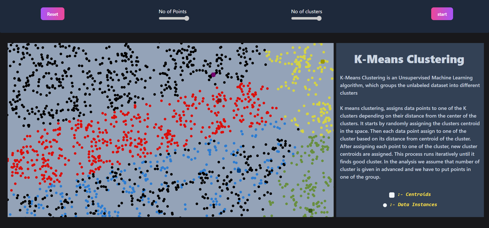

# Algorithm Visualizer

A React.js application that visualizes various algorithms including sorting, Huffman coding, and k-means clustering.

## Table of Contents
- [Features](#features)
- [Demo](#demo)
- [Installation](#installation)
- [Usage](#usage)
- [Technologies Used](#technologies-used)


## Features
- Visualize sorting algorithms: Bubble Sort, Quick Sort, Merge Sort, etc.
- Huffman Coding visualization.
- K-means clustering demonstration.
- Interactive and intuitive user interface.

## Demo
- **Video Demo**: [Watch on YouTube](https://youtu.be/example)
- **Screenshots**:
  
  
  

## Installation
1. Clone the repository:
   ```bash
   git clone https://github.com/UVM003/Algorithm-Visualizer.git
   cd Algorithm-Visualizer
   npm install
   npm start
   
## Usage
Open your browser and navigate to http://localhost:3000.
Select an algorithm from the menu.
Follow the on-screen instructions to visualize the algorithm.

## Technologies Used
Javascript
React.js
Tailwind CSS
